#从Scratch到Python——python turtle
#### 一种比pygame更加简洁的实现

>现在很多学校都开设了Scratch课程，学生可以利用Scratch创作丰富的作品，然而Scratch之后的图形化编程语言学习什么内容，是一线老师和Scratch官方共同关注的问题。

就目前来看可以选择的有C语言、Logo、Python和SmallBasic。就我个人而言是倾向于Python的。因为C语言虽然经典，但是学了很久也不能做出可视的成型的作品，极大的降低了孩子们的积极性；Logo语言仅仅是一门玩具型的编程语言；Smallbasic和Logo语言的情况类似；而Python语言已经做为编程入门语言得到了广泛的任何，相比于c语言，入门简单，而且Python可以用很少的代码完成复杂的工作，在以后的工作学习中都会用到，对于一般人来说C语言是屠龙之技，即便是在大学里的C语言通修课也是如此，而且目前部分大学的已经开始慢慢的把通识课的入门编程语言改成Python了。毕竟人生苦短我用Python呢。

但是Python作为一种文本编程语言，对于小学生来说还是有一定难度的，所以从Scratch到Python肯定需要一个过渡，我对于这个问题思考了很长时间，我觉得在学习了Scratch基础上，结合Scratch来学习Python是合适的。

学习任何一种编程语言，首先要了解诸如变量、循环、分支判断这些基本的程序结构，经过Scratch的学习，学生对于这些概念基本掌握，在学习Python的时候，用Scratch来描述程序，作为思维可视化的工具，有助于学生快速的掌握Python。

闲言少叙，下面我们就开始Python的学习，话说如果一开始就讲Python的变量肯定会被吐槽，全部是文本，黑咕隆咚的窗口，没什么意思啊，那么们就从窗口开始。
## 安装Python
(从官网下载Python 3.6如果是xp下载3.5，然后看下基本的Python安装和使用介绍，启动IDLE)
## 启动IDLE

安装python之后，开始菜单，python，IDLE，就可以启动了。

## 神奇的小乌龟

在正式学习Python之前我们先来体验下用Python来绘制图形，如果你看不懂也没有关系，先照着教程把代码查下来就是了，就像是联系书法开始肯定有个临摹的阶段，我们先体验，后面详细讲解为什么这么做

下面我们隆重的请我们的Python小乌龟入场。

首先在IDLE的代码编辑器输入以下代码
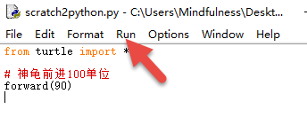
然后单击运行
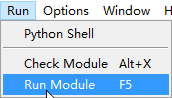
### 解释
我们来解释下这段代码
```
from turtle import *
```
是从Python的库中导入turtle这个类，当导入的时候，其实小乌龟已经存在了，只是我们看不到而已。当你通过
```
forward(90)
```
命令让小乌龟前进90个单位的时候惫懒的小乌龟才出现在舞台上，forward的意思是前进，forward后面括号里的是参数，描述乌龟前进的距离，这是一个固定的写法。
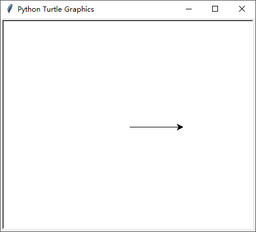
是不是觉得眼熟呢，在Scratch，是不是有点像Scratch里面让小猫动起来呢？
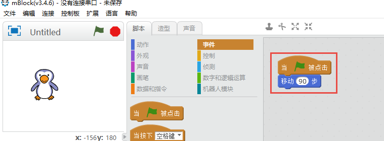

在turtle里面，默认画笔是落下的，所以小箭头移动的时候就会画图，我们记得scratch里面有一个抬笔积木，在turtle也有，不过是
```
penup()
```

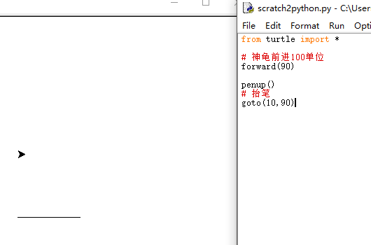
```
from turtle import *

# 神龟前进100单位
forward(90)

penup()
# 抬笔
forward(90)
```
首先我通过```penup()```命令抬笔，然后利用```goto(10,90)```命令让小乌龟移动到(10,90)
其实这个时候，调用前面的向前移动forward命令也不会留下痕迹的
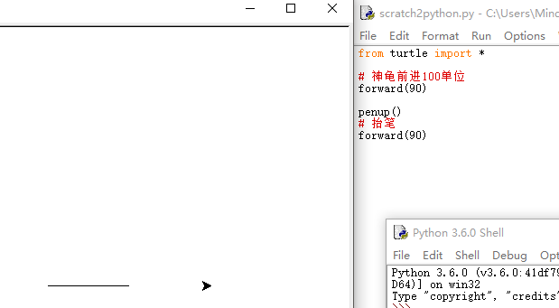
## 绘制正方形
下面我们来绘制一个正方形，首先我们用scratch来实现绘制正方形这个功能，我们用最简单的顺序命令来实现
### Scratch程序绘制正方形
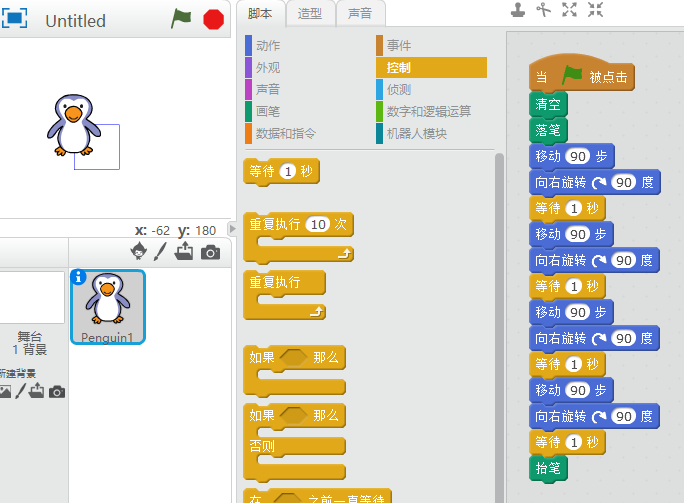
可以看到
+首先拖动绿旗模块到舞台
+然后清空舞台
+落笔
+让小企鹅前进90步，然后右转90°，等1s钟
+重复以上步骤四次
+抬笔，准备下一次绘图
这是一个典型的绘制正方形的程序，采用了顺序结构来编制程序，便于理解。

接下来我们用python中的turtle库实现这个程序

### Python版本的正方形绘制程序

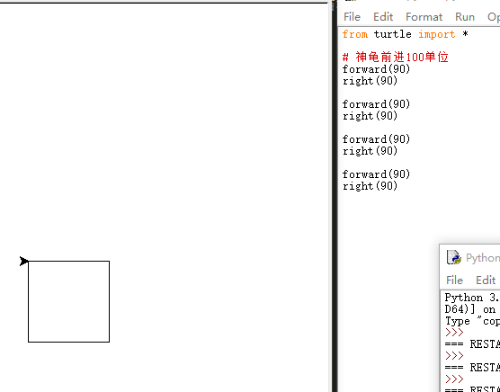
```
from turtle import *

# 神龟前进100单位
forward(90)
right(90)

forward(90)
right(90)

forward(90)
right(90)

forward(90)
right(90)
```

看，虽然一个是图形编程，一个是文本编程，但是都成功的绘制出了正方形。下面我继续完善，我们知道在Scratch中是可以改变画笔属性的，比如画笔粗细，画笔的颜色等等，在python也是可以的，看下面的表格


|-|-|-|
|-|-|-|
|Scratch代码块|Python命令|作用|
|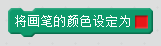|```pencolor()```|设定画笔颜色，用颜色选择器选择颜色|
|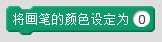|```pencolor()```|Scratch通过数值，python通过颜色字符串设定颜色|
||```pensize()```|设定画笔粗细|

比如我们要画一个边框粗为4，颜色为红色的正方形
#### Scratch版本
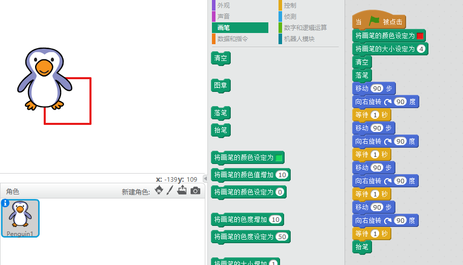
#### Python版本的画正方形
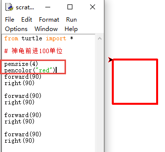
代码如下
```
from turtle import *

# 神龟前进100单位

pensize(4)
pencolor("red")

forward(90)
right(90)

forward(90)
right(90)

forward(90)
right(90)

forward(90)
right(90)
```
可以看到，我们用python里面的命令完成了与scratch相同的功能，是不是相当有趣呢？

## 变量
前面我们画了一个边长为90的正方形，如果我们想让正方形的边长是100怎么办呢？我们先来看最原始的方法，那就是把scratch或者Python中代表边长的数字90分别改成100：
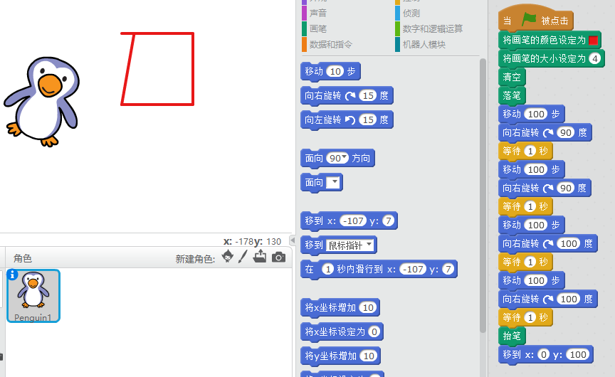
你会发现这次不是正方形啊，哦，原来是我把最后一个右转90°，也改成100，导致右转了100°，你看，这样一个个的修改不仅麻烦，而且容易出错，怎么办呢，我们用一个变量代表边长。
***变量是一个容器，里面存放着代表边长的数字。***
#### 在Scratch中新建变量
经过前面多学习，大家已经掌握了在scratch中新建变量，下面我们新建一个代表边长的变量side，然后把程序中代表边长的100改成变量side
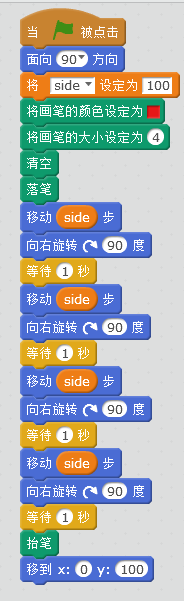
然后我们改变side值，就可以轻松的绘制不同边长的正方形了
#### 在Python中新建变量
python是一种解释语言，无需声明就可以新建变量，新建变量只需要用下面的语法
```
side = 100
```
这样就新建了一个side变量，代表100，这里的```=```等号的含义是，把右侧100的值放到变量side中，side代表100.
我们看如何用python来实现用变量来代表数值绘制正方形
```
from turtle import *

# 神龟前进100单位

side = 100

pensize(4)
pencolor("red")

forward(side)
right(90)

forward(side)
right(90)

forward(side)
right(90)

forward(side)
right(90)

```
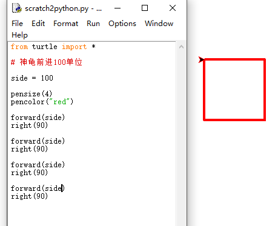

>那么，亲爱的朋友，你能够新建一个angle变量，代替角度吗？

## 重复循环

在日常生活中，我们经常会遇到一个枯燥而重复的事情，为了从这些劳动摆脱出来，人们发明机器以及机器人，代替人类完成这些枯燥重复的事情。与人类不同的是，计算机特别擅长做简单重复的事情，效率和准确率比我们人类要高很多。通过合理的使用重复循环，我们可以大大提高程序的效率。

```
from turtle import *

forward(90)
right(90)

forward(90)
right(90)

forward(90)
right(90)

forward(90)
right(90)
```
>仔细观察以上代表，是不是，是不是感觉有很多地方是重复的呢？一般在计算机中超过三次重复就可以考虑使用循环来简化代码

在scratch中，控制积木分类中有重复积木：
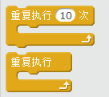
下面我们利用scratch中的循环来简化代码
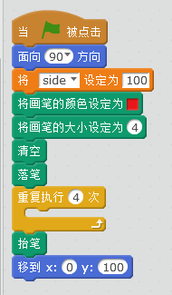
仔细观察以上代码，想一想在重复4次内部应该放入那些积木块呢？这样代码是不是简单了很多？
#### Python循环
python中的循环，需要用到```for...each...```语句，在这里会涉及到python一个非常有意思的地方，缩进语法
```
from turtle import *

for each in range(4):
    forward(90)
    right(90)

```
执行以上代码，会发现，出现了一个正方形，需要注意的是，```forward(90)```以及```right(90)```语句比for缩进了4个空格，这也是python的特点之一，缩进语法，这是for的固定写法，大家要知道，而且一定不要漏掉冒号哦。

## 更多类似
有人说，不是python turtle小乌龟吗，为什么只有箭头呢？scratch舞台上有各种各样的角色，python turtle只有个箭头是不是太寒酸了呢？turtle也可以多种多样哦！
需要改变箭头的形状要用到```shape()```命令，下面我们来试一下
```
from turtle import *

shape('turtle')

for each in range(4):
    forward(90)
    right(90)
```
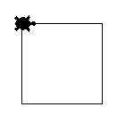
有没有觉得小乌龟太小了？我们来改变小乌龟的大小
```
from turtle import *

shape('turtle')
shapesize(5,5,5)

for each in range(4):
    forward(90)
    right(90)
```
运行以上代码，是不是发现小乌龟变大了呢？

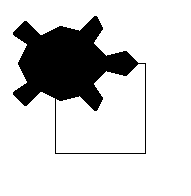
当然python turtle中小乌龟的形象不仅可以是小乌龟，箭头，还是是圆和正方形。
>小结：python urtle某种程度上跟logo小乌龟是比较类似的，肯定有人会疑问为什么不直接学习logo呢？因为logo基本上已经被淘汰了，我们最主要的目的还是学习python，python turtle以及结合scratch只是防止单纯的学习python过于枯燥的弱点，当然真正的掌握了python以后就不会有这样的感觉，基本上scratch大部分功能都可以用python turtle来实现，这样就可以顺利的帮助小孩子从scratch过渡到python。

## 先来看最经典的例子

在scratch教程中，一般开始都是先做一个小猫来回跑动的例子，来吸引小盆友，python turtle做这样的例子其实很简单的，我们先来看用scratch怎么做：

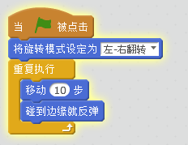
下面我们用python来实现，现在看不懂不要紧，看完后面的就能看懂了。

```
from turtle import *

shapesize(4,4,4)

penup()

x = 0

v = 5

while 1:
    goto(x, 0)
    x += v
    if x < -200:
        v = -v # 当箭头到了左侧边界，让x增加
    if x > 200:
        v = -v # 党建头到了右侧边界，让x减少
    
```
以上代码实现了箭头来回走动，其实原理很简单的```v = 5```跟的作用类似，是用来设定角色移动的速度，而与对应的则是以下代码：
```
	if x < -200:
        v = -v
    if x > 200:
        v = -v
```
我来解释下这段程序，首先导入必要的库，然后利用```shapesize()```命令设置箭头的大小，然后```while```循环的作用于scratch的重复类似，不停的执行以下代码，首先让箭头移动到(0, 0)坐标，然后把x坐标增加步数v，然后判断改变后的x坐标是否大于200，大于200则意味着箭头超过了右侧的边界，那么x就应该向相反方向移动，这也就是scratch中的含义，本来向右移动是让x坐标不断的增加步数v，如果要向左移动，就要减去步数，所以当箭头的横坐标大于x的时候就让x减去步数；同样的当x的坐标比-200小时，意味着箭头到了左侧边界，那么不再让x坐标减去步数v，而是让x坐标增加。

## 关于事件

在scratch中事件是很常用的功能，比如当鼠标被单击的时候，角色说话：
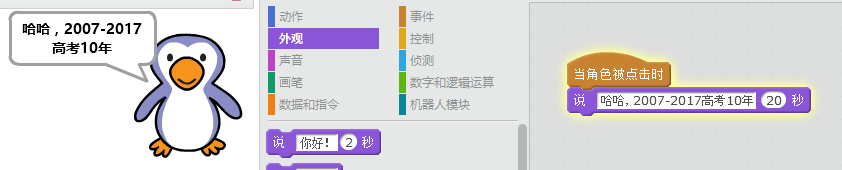
其实小乌龟也是可以的，不过呢这里要用到函数的功能，不知道各位看官在Scratch里有没有学习函数的功能呢，这里要介绍python里面函数的语法
```
def function_name():
    pass
```
可以看到，首先要有def关键字，然后空一格，然后是函数名，括号以及冒号，冒号是必不可少的内容！
```
from turtle import *

shape('turtle')

def sayhello(x, y):
    write('2007-2017高考十年')

onclick(sayhello)


```
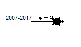
运行上述代码，会发现当你单击小乌龟的时候，小乌龟会说出我们指定的话语，'2007-2017高考十年'，有没有很唏嘘。
这里需要注意但是函数sayhello有两个参数x，y分别代表小乌龟当前的横纵坐标。同时onclick函数的参数，是一个函数名，这里面涉及到了回调，当然我们知道怎么一回事就可以了，当你希望被单击的时候执行那个函数对应的功能呢，你就在onclick的参数里面写上这个函数就可以了。


## 关于动作积木块的类比

|-|-|-|
|-|-|-|
|Scratch代码块|Python命令|作用|
||```setx()```|设定x坐标|
||```sety()```|设定y坐标|
|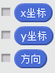|```xcor();ycor()```|获取xy坐标|


